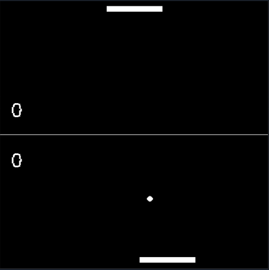

# Pong with IMU Controller

- Reads IMU roll/pitch data over serial-to-USB interface
- Treats this as controller input data for pong paddle motion
- Plays as a Pong clone written in C using SDL2 for graphics

